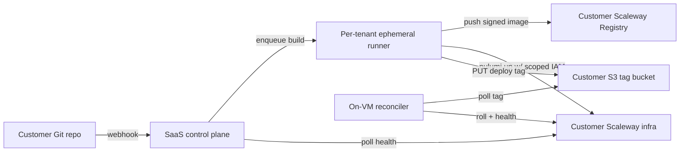

# SOVRUN — A Scaleway-native deployment SaaS blueprint

Analysis of whether the Raak/Cella CI + deployment pipeline can serve as the blueprint
for a SaaS that runs this deployment strategy per organization through a dedicated
runner (instead of GitHub Actions), targeting EU customers on the TypeScript + Postgres
niche who want Render.com-grade ease of use on Scaleway.

Source workflows analysed:
- [.github/workflows/deploy.yml](../.github/workflows/deploy.yml)
- [.github/workflows/ci.yml](../.github/workflows/ci.yml)
- [.github/workflows/infra-preview.yml](../.github/workflows/infra-preview.yml)

---

## Key insight: the pipeline is already pull-based

The deploy is **not really push-based**. GitHub Actions only does two things that touch
the running infra:

1. `pulumi up` — declarative infra reconciliation.
2. `roll-services` — writes an image SHA to `s3://<deploy_tags_bucket>/deploy/<svc>.tag`,
   then **polls a health endpoint** until the VM reports the new `X-App-Version`.

The actual rollout is performed by an **on-VM reconciler that pulls the tag from S3** and
rolls itself forward/back. GitHub Actions is just an orchestrator that pokes object
storage and waits. That's a pull-based control loop wearing a push-based coat.

This matters enormously for the SaaS thesis: **the hard, security-sensitive part already
lives outside CI.** The reconciler, health gating, tag rollback, and in-host rollover logic do
not depend on GitHub. Swapping GitHub Actions for "a dedicated runner per org" mostly
replaces the *orchestrator*, not the *deployment engine*.

---

## What is genuinely reusable as a product

| Pipeline asset | SaaS value |
|---|---|
| `print-deploy-env` (derive all resource names from shared config) | This is the **tenant model**. One config → all Scaleway resource names. A clean multi-tenant primitive. |
| Pulumi + S3 state on Scaleway Object Storage | Per-org stack + per-org state bucket = clean isolation boundary. |
| On-VM reconciler + S3 tag bucket | The differentiator. Pull-based rollout that survives a dead control plane. |
| Cosign keyless signing, pinned action SHAs, pinned upstream SHA guard | "Secure supply chain by default" — a real selling point to European buyers. |
| Frontend GC + strict upload ordering + edge purge + served-bundle verification | The unglamorous correctness work competitors skip. |
| `pulumi preview` on PRs | "See your infra diff before deploy" — a Render/Vercel-grade DX feature. |

---

## Positioning: "Render, but on your own Scaleway"

Render/Vercel/Railway are deliberately cloud-agnostic and abstract the provider away.
The wedge here is the opposite, and it is defensible:

- **"Own your Scaleway account, we run the pipeline."** Customers keep data, billing, and
  compliance in an EU provider (GDPR, data residency, Scaleway's EU-only posture). That is
  a real pain point Render does not solve for EU-sovereignty-conscious buyers.
- **Opinionated stack (TS + Postgres).** Because the stack is assumed, the product can ship
  deep features (Drizzle migration gating, SDK generation, sync-engine awareness) that a
  generic PaaS cannot.

---

## The hard parts not to underestimate

1. **Per-org runner = per-org credential custody.** Today the secrets (`SCW_SECRET_KEY`,
   `PULUMI_CONFIG_PASSPHRASE`) live in GitHub. As a SaaS *you* hold or broker the keys to
   customers' infra — a blast-radius and liability problem that dwarfs the pipeline
   engineering. You need scoped credentials (Scaleway IAM applications per tenant,
   short-lived), an HSM/KMS-backed secret store, and ideally a model where the runner runs
   **in the customer's own Scaleway project** so you never hold long-lived keys. This is the
   make-or-break design decision.

2. **The runner itself is the attack surface being sold away.** The pitch is "offload the
   burden of *securing* CI/CD," so the runner must be more secure than what a customer would
   self-host: isolated per tenant (no shared runner reuse — the classic CI multi-tenant
   RCE → credential-theft path), ephemeral, with signed pipeline definitions and no
   arbitrary customer code that can reach other tenants' state buckets.

3. **GitHub Actions does a lot of invisible heavy lifting** that would need rebuilding:
   artifact storage, caching (`actions/cache`, buildx GHA cache), concurrency groups, OIDC
   federation for cosign, secrets UI, logs, reruns, and branch-protection integration. The
   dedicated runner needs equivalents or customers regress in DX.

4. **The config is currently cella/raak-specific.** `print-deploy-env`, the service matrix
   (backend/cdc/yjs/ai), and `cella.config.ts upstreamPinnedSha` encode *this* app's shape.
   Productizing means extracting a generic tenant manifest schema — doable, but a real
   abstraction layer, not a rename.

5. **Pull-based reconciler ↔ rollback semantics are subtle** (the workflow's own comments
   warn CI must not race the VM's rollback). Multiplied across N tenants with N health
   contracts, it becomes a distributed-systems product, not a script.

---

## Proposed architecture

Critical principle: **runners and state live as close to the customer's own Scaleway
project as possible; the control plane orchestrates but holds minimal long-lived secrets.**

---

## Verdict

- **As a technical blueprint: yes, strongly.** The genuinely hard correctness problems
  (pull-based rollout, health gating, frontend cache coherence, supply-chain hardening) are
  already solved. Most "deploy to a VPS" startups have none of that.
- **The product is not the pipeline — it is the multi-tenant credential/runner isolation
  layer.** That is roughly 80% of the remaining work and 100% of the risk. Nail tenant
  isolation and credential custody, and the EU-sovereign / TS+Postgres / "Render but on
  your own Scaleway" niche is real and underserved.
- **Biggest strategic risk:** Scaleway-only is both the moat and the ceiling. Validate that
  enough EU buyers want *managed pipeline + their own Scaleway account* rather than *fully
  managed PaaS* before building the multi-tenant machinery.

---

## Highest-leverage next artifacts

- A tenant manifest schema generalizing `print-deploy-env`.
- A threat model for the per-org runner isolation and credential custody design.
