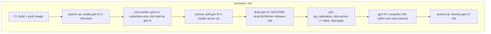

# Zero-downtime immutable-node deployment

Status: **implemented** (2026-06-18) · validated by `pulumi preview` against production (0 errors) + infra test suite. Scope: **every** deploy — routine image release *and* infra change — through one immutable-node rollout path

> **Apply prerequisite:** the old `deploy-tags` bucket is removed by this change but is non-empty, so empty it before the first `pulumi up`: `aws s3 rm s3://<slug>-deploy-tags --recursive` (it was unprotected in state during implementation). The first apply replaces all VMs (brief downtime, accepted). The `tasks/cutover.ts` zero-downtime choreography (LB-overlap bookends) is built and unit-tested but not yet wired into `deploy.yml`, which currently does a plain generation replacement — see §6.7.

## 1. Problem & scope

Today there are **two** rollout systems, and the larger one exists only to work around a limitation we are about to remove:

| Layer | Trigger | Mechanism | Replaces VM? |
|---|---|---|---|
| Routine image release | new SHA in `deploy/<svc>.tag` | pull-based reconciler rolls the app container in-place behind a per-VM ingress (intra-VM blue/green slots) | no |
| Infra change | cloud-init / AMI / kernel edit | destructive VM replacement (`deleteBeforeReplace: true`) → 503 until the new VM boots | yes (with downtime) |

The reconciler + deploy-tags + in-VM blue/green subsystem is engineered around **one** constraint, stated verbatim in the [deploy-tags](../infra/resources/deploy-tags.ts) header: *"Keeping it out of cloud-init means a release never mutates VM userdata… VMs stay long-lived."* Because VM replacement was destructive, releases were built to **never** replace the VM — the image SHA lives out-of-band in S3, VMs are long-lived, and a systemd reconciler autonomously converges each box. That entire apparatus is a workaround for destructive replacement.

**Once node replacement is itself zero-downtime, the workaround is obsolete.** This plan makes node replacement the single rollout primitive: every change to a service's **VM image or cloud-init** provisions a **new immutable VM generation** (the image SHA baked into its cloud-init), health-gates it, atomically cuts the load balancer over, drains and destroys the old generation. The two systems collapse into one, so this is a **net deletion** — a large subsystem (reconciler, deploy-tags bucket + IAM, in-VM blue/green, the S3 status/diagnostics channels) is removed, replaced by one CI-driven cutover task.

Non-goals / disclosed exceptions: contract (destructive) migrations remain a separate manual step; **frontend static-asset releases stay an S3 upload with no VM change** (§5); and an **instance-type resize is a provider-level stop/start blip** (`replace_on_type_change` false), handled outside the cutover (§9). AMI/kernel rebuilds produce a genuinely new image — they flow through the same cutover.

## 2. Strategy

Immutable generations with the industry-standard rollout triad — **create-before-destroy → health-gate the new node → drain the old on removal** — the same shape as a Kubernetes rolling update (`maxSurge` + readiness probe + `terminationGracePeriodSeconds`) or AWS ASG instance-refresh (`min_healthy_percent`) + ALB `deregistration_delay`. Scaleway has no managed instance group / instance-refresh / deregistration-delay primitive, so the rolling controller is hand-rolled (option **1b** below), but the provider gives the atomic LB primitive we need.

### LB re-point is atomic at the API, near-zero-drop with overlap

`scaleway.loadbalancers.Backend.serverIps` is an **in-place-updatable list** (only `lbId` forces recreation); the underlying `SetBackendServers` call replaces the whole server list in one atomic server-side operation. A single `[old] → [new]` swap is atomic but **not** drop-free (the new server may not be health-confirmed at the swap instant). Near-zero-drop requires **expand-then-contract**:

1. `serverIps = [old, new]` — new health-checks UP while old keeps serving (overlap).
2. `serverIps = [new]` — old removed; with `on_marked_down_action: 'none'` its in-flight connections drain over `timeout_server`.

Each step is one atomic call; the overlap is what drives dropped connections to ≈0. There is **no** AWS-style deregistration-delay primitive — we hand-roll the drain with the existing `drainSeconds` registry field.

### Orchestration home: 1b (CI-driven cutover task)

Pulumi cannot pause mid-replacement for an external health gate, so the rolling controller lives **outside** the Pulumi lifecycle in a testable task (`infra/tasks/cutover.ts`), mirroring `tasks/assert-secrets-deliverable.ts`. The split of responsibility is the key design rule that makes the live LB re-point both atomic and parallel-safe (see §10):

- **Pulumi owns VM lifecycle only** — it creates/destroys generation VMs + their IPs/NICs, owns the LB resource, and sets the *initial* backend `serverIps` at creation. Each `Backend` declares `ignoreChanges: ['serverIps']`, so Pulumi never reconciles the live server list back to stack config. The generation marker in stack config is the source of truth for *which generations exist*.
- **The cutover task owns the live `serverIps`** during a deploy via **direct `SetBackendServers` API calls** (the pure, fetch-injectable `expandBackend`/`contractBackend`). No `pulumi up` is in the expand/contract hot path.
- **`pulumi up` runs exactly twice per service cutover** — a *create* bookend (gen N+1, before the health gate) and a *destroy* bookend (gen N + marker bump, after drain). The live LB re-point in between is pure API.

This **replaces** the pull-based reconciler entirely — CI is now the synchronous deploy driver rather than each VM converging on its own.

## 3. Per-service replacement strategy

A single rollout axis now (the intra-VM `rolloverStrategy` is removed — see §7):

- `replacementStrategy`: node cutover on **any** deploy. `lb-overlap | exclusive`.

| Service | lbRoute | `replacementStrategy` | `drainPolicy` | Cutover semantics |
|---|---|---|---|---|
| backend | default | `lb-overlap` | `requests` | LB expand→health→contract→drain |
| frontend | host | `lb-overlap` | `requests` | infra change only (content = S3 upload, §5) |
| yjs | host (ws) | `lb-overlap` | `reconnect` | LB overlap; old gen de-registered, clients reconnect to new node |
| ai | host | `lb-overlap` | `requests` | LB expand→health→contract→drain |
| cdc | — (internal) | `exclusive` | n/a | warm standby → drain old → old releases slot → new acquires |

**Why cdc is `exclusive`, not cold-swap:** cdc streams one PostgreSQL logical replication slot (`cdc_slot`, [cdc/src/constants.ts](../cdc/src/constants.ts)). Postgres permits exactly one active consumer per slot, so slot-consumption overlap is *physically impossible* — a second consumer gets `replication slot "cdc_slot" is active for PID …`. But cdc still gets the create-before-destroy **shape**: the new VM boots warm and its [`subscribeWithReconnect`](../cdc/src/pipeline/replication.ts) loop idle-contends for the slot while the old worker still holds it; on cutover the old worker drains and releases the slot via `setupGracefulShutdown` ([cdc/src/cdc-worker.ts](../cdc/src/cdc-worker.ts)), and the new worker acquires within one retry interval. The handoff is **lossless** — the slot retains the WAL position, the new worker resumes exactly where the old stopped, and catchup mode absorbs the gap. Cost is bounded latency, never data loss.

`replacementStrategy` is **stored explicitly** in the registry (though derivable today: `lbRoute` present → `lb-overlap`; absent → `exclusive`), so a future LB-less internal worker can opt into overlap semantics that pure derivation would wrongly force to `exclusive`. A validation test asserts the derivation still holds for every current service.

**`drainPolicy` (HTTP vs. WebSocket).** Removing the old generation from the LB drains differently by protocol, so it is a per-service knob rather than one global `onMarkedDownAction`:
- `requests` (backend/frontend/ai): `onMarkedDownAction: 'none'` + short `drainSeconds` (~10s) — in-flight HTTP requests finish, then the old gen is destroyed.
- `reconnect` (yjs): WebSocket sessions are **not** held for `timeoutServer`. The old gen is de-registered and the client reconnects to the new generation, resyncing from durable CRDT/document state (connection-bound holding would be wasteful and pointless because the state is not connection-bound). `drainSeconds` is a few seconds only — just long enough for clients to notice the drop and reconnect.

## 4. Key design decision — addressing model

Per-generation IPs are the prerequisite for create-before-destroy, but the current pinned IP is also the **inter-service binding target** (`@{backend.privateIp}` resolves at plan time; cdc's `API_WS_URL` targets it). Splitting these concerns:

- **Public LB targets** (backend/frontend/yjs/ai): each generation VM gets its **own** private IP; the LB backend `serverIps` = the list of currently-active generations. The LB tracks generations directly — no stable per-service IP needed, true overlap, zero drop.
- **Internal binding target** (backend, consumed by cdc over `ws://…/internal/cdc`): introduce a **stable internal service address** decoupled from VM generation, so a backend replacement does not cascade into a cdc cloud-init change.

**Decision: reattached IPAM IP.** A dedicated reserved IPAM IP for "backend internal" is attached as a second `ipamIpId` on the active backend generation's NIC and **moved to the new generation at the contract step**. cdc keeps a stable `API_WS_URL`; its wsClient reconnects through the same address now served by the new node (sub-second blip, lossless via the slot).

- Why not private DNS: a VPC private-DNS record (updated to the new generation IP at cutover, cdc re-resolving on reconnect) is cleaner config but stands up a whole DNS subsystem for a **single** internal edge, adds DNS-TTL latency, and exposes a non-deterministic failure surface — Node's resolver can cache a stale IP past the cutover even with a tiny TTL. IPAM reattach is deterministic and has none of that. Revisit DNS only if ~3+ internal bindings appear, where the indirection starts paying for itself.
- **Failure mode to guard:** if the reattach lands *before* the new backend generation is actually serving `/internal/cdc`, cdc reconnects into a black hole for a few seconds. Mitigation: gate the reattach on the same app-`/health` poll already in the cutover flow — reattach only after the new generation is health-confirmed.

## 5. Flows

For backend / yjs / ai (and frontend *infra* changes), routine release and infra change are the **same** flow; the only difference is whether cloud-init content changed in addition to the image SHA. Both produce a new generation. **Frontend content releases are different** — the frontend VM's Caddy reverse-proxies the asset S3 bucket, so a routine frontend release uploads versioned assets to S3 and changes **nothing** on the VM: no generation, no cutover (the existing `deploy-frontend` S3-upload job, unchanged). Only a Caddy-config / cloud-init / CSP change replaces the frontend VM via the flow below.

```mermaid
flowchart TD
  subgraph lbOverlap[lb-overlap: backend / frontend / yjs / ai]
    A0[CI: build + push image to registry] --> A1[pulumi up: create gen N+1 VM, SHA baked in cloud-init]
    A1 --> A2[gen N+1 boots: pull image, run expand-migrate one-shot if RUN_MIGRATE, start app]
    A2 --> A3[cutover: poll new app /health 200 AND X-App-Version == SHA]
    A3 --> A4[LB serverIps = gen N, gen N+1  expand]
    A4 --> A5[poll LB until gen N+1 UP]
    A5 --> A6[reattach stable internal IP to gen N+1  backend only]
    A6 --> A7[LB serverIps = gen N+1  contract]
    A7 --> A8[wait drainSeconds  drainPolicy: requests=drain HTTP / reconnect=let WS clients re-dial]
    A8 --> A9[pulumi up: destroy gen N VM unless keepPreviousGeneration; bump generation marker]
  end
```

If the new generation never reaches its health gate (bad image, failed migrate, crash loop), the cutover **aborts before any LB change** — gen N keeps serving, so there is no outage; CI fails loudly with the new VM's logs. Note the expand-migrate (§6.3) runs at gen N+1 **boot**, before the health gate, so on abort the schema migration has *already been applied* — safe because it is forward-compatible (gen N's code tolerates the new schema), and the next deploy attempt re-runs it idempotently. "gen N untouched" means *still serving*, not *DB unchanged*.

## 6. New / changed components

1. **`infra/tasks/cutover.ts`** — the single deploy driver, split into a **pure core** + a thin impure entrypoint (§2):
   - *Pure, fetch-injectable core* (mirrors `assert-secrets-deliverable.ts`, fully unit-testable): `expandBackend(lbId, backendId, ips)` / `contractBackend(lbId, backendId, ips)` → direct atomic `SetBackendServers`; `pollNodeHealthy(host, port, expectedSha, timeout)` → polls the app's `/health` until 200 **and** `X-App-Version == SHA` (the identity gate that used to live in `reconciler.sh`; the app binds the host port directly now — no ingress hop); `pollSlotReleased(…)` → for `exclusive`, polls `pg_replication_slots.active == false` before destroy; `sequenceCutover(…)` → orders expand→health→reattach→contract→drain as pure steps over injected effects.
   - *Impure entrypoint*: invokes the two `pulumi up` bookends (create gen N+1, destroy gen N) and `pulumi config set` for the generation marker. Subprocess calls live **only** here, keeping the core pure.
   - Standalone entry + `infra/package.json` script `"cutover": "tsx tasks/cutover.ts"`.
2. **Image SHA baked into the new generation** — cloud-init for `vm-<svc>-<gen>` pins `RELEASE_SHA` in the compose env; the VM pulls that exact tag at first boot. No out-of-band tag channel, no on-VM watcher — the generation *is* the release.
3. **Expand-migrate at new-gen boot** — services with `RUN_MIGRATE=1` (backend) run the one-shot migrate container in cloud-init **before** the app starts. Migrations are additive (expand-before-cutover convention preserved), so gen N keeps serving the pre-migration schema until cutover. A failed migrate means the new gen never goes healthy → cutover aborts → gen N untouched.
4. **Generation marker** — per-service live/pending generation in **stack config** (`infra:gen:<svc>` / `infra:pendingGen:<svc>`), bumped by the cutover task via `pulumi config set` between the create and destroy `pulumi up` steps. Stack config (not VM tags, not a side-car S3 marker) keeps the pointer atomic with `pulumi up` and in one source of truth. Pulumi names VM resources `vm-<svc>-<gen>` and derives LB `serverIps` from an `activeGenerations[svc]` stack input.
5. **Registry field** — `replacementStrategy: 'lb-overlap' | 'exclusive'` on `AppServiceConfig` in [config/services.config.ts](../infra/config/services.config.ts), resolved generically in compute/loadbalancer.
6. **LB backend wiring** — [resources/loadbalancer.ts](../infra/resources/loadbalancer.ts) sets the *initial* `serverIps` from the active-generation IP list (rather than `[getInstanceIp(slug)]`) but declares `ignoreChanges: ['serverIps']` so the live list is owned by the cutover task (§2); the health check targets the app's `/health` (not the removed `/__ingress/health`); `onMarkedDownAction` follows `drainPolicy` (`none` for `requests`, session-shedding for `reconnect`).
7. **deploy.yml** — one path: build + push image → `pnpm --filter infra cutover --service <svc>`, **staged exactly like today's flow** to preserve migration correctness:
   - **Backend first.** Backend owns the expand-migrate (run at its new-gen boot, §6.3), so its cutover must complete before any service whose new code expects the new schema goes live.
   - **The rest in parallel after backend** — cdc, yjs, ai cut over concurrently once backend's new generation is healthy (migration already applied). Real parallelism is possible because the live LB re-point is direct API, not `pulumi up` (§2): only the fast create/destroy `pulumi up` bookends take the stack lock, and those serialize briefly while the slow health/drain windows overlap freely.
   - **Frontend completely parallel.** A frontend *content* release is an independent S3 upload (no cutover, §5); a frontend *infra* release cuts over independently of the backend→rest chain.

   Deploy time is therefore ≈ backend's cutover + max(rest), with frontend overlapping the whole thing — not the sum of all five. The expand-before-cutover convention (§6.3) is what makes the *within-stage* parallelism safe: every service in a stage tolerates either schema while a peer is mid-cutover. This mirrors the existing `roll-backend → roll-rest` job graph (frontend independent), just with the cutover task replacing the per-VM reconciler roll.
8. **Runtime-secret manifest returns to cloud-init** — the out-of-band S3 manifest (Improvement 1) existed only to avoid VM replacement on secret-add; under immutable releases every change replaces the VM anyway, so the manifest (metadata only — secret IDs + env names) goes back into the new generation's cloud-init. The base64 multi-line-secret fix from Improvement 1 stays; the S3 object, its IAM grant, and the per-tick refetch go.

## 7. Cleanup — the subsystem this replaces

No migration shims, no deprecation period. The immutable-node path makes the entire pull-based release machinery dead code:

**Reconciler subsystem (whole) — delete**
- `infra/reconciler/reconciler.sh` (~400 lines), `reconciler.service`, `reconciler.timer`, and [reconciler/index.ts](../infra/reconciler/index.ts) (`buildInstallSnippet`, `buildReconcilerEnv`, the systemd install). The 20s converge loop and its `flock` serialization have no purpose when a deploy *is* a new VM.
- **In-VM blue/green** — `blue_green_roll`, `bg_probe_slot`, `bg_probe_ingress`, `active.slot` tracking, the `caddy reload` upstream flip, `bootSlotService`, and the `UPSTREAM_HOST` slot-pointer. Overlap now happens at the **LB** between generations.
- **Registry re-login** — `registry_login()` existed solely because *"on a long-lived VM the stored login goes stale."* One-release VMs never have stale tokens.
- **Tag state + in-container rollback** — `commit_tag_state`, `current.tag`/`previous.tag`. Rollback is now "keep the LB on gen N" (still alive during overlap) or re-cut to the prior SHA — simpler **and** safer than tearing a container back.
- **Status + diagnostics channels** — `publish_status` + `status/<svc>.json`, `upload_failed_logs`, `upload_diag_text`, the `boot-diag/` prefix, and the CI `fetch-boot-diag` step. CI now drives the roll synchronously and sees health-poll failures inline; the new VM is still alive on failure for inspection (serial console).
- **Pull/migrate retry ladders** in the script — the registry pull retry stays as a small loop in cloud-init at first boot; the elaborate `MIGRATE_RETRIES`/backoff/boot-diag-on-exhaustion scaffolding collapses into the one-shot migrate gate.

**Deploy-tags bucket (whole) — delete**
- The `scaleway.object.Bucket` `deploy-tags-bucket`, its `BucketPolicy` (the 3-way Pulumi/CI/VM IAM split), `deployTagKeys`, `deployTagsBucketName`, the CI `s3:PutObject deploy/*` grant, and the VM `s3:GetObject deploy/<own>.tag` grant in [resources/deploy-tags.ts](../infra/resources/deploy-tags.ts). The image SHA is now in cloud-init; CI talks to the registry + Scaleway API directly, not S3. (VM `ContainerRegistryReadOnly` creds stay — the new VM still pulls the image.)
- The `manifest/*` object + its VM read grant go with it (§6.8).

**Registry field + per-VM ingress**
- **`rolloverStrategy`** (`blue-green | in-place`) and its consumers — removed from the registry and everywhere it is read; there is only one rollout path now.
- **Generic per-VM ingress ([ingress.Caddyfile](../infra/ingress.Caddyfile)) — removed for backend / cdc / yjs / ai.** That proxy did only three things, all of which served in-VM app rollover: a static `/__ingress/health` 200, a `lb_try_duration` retry to bridge the app-container restart gap, and the host-port listener. With immutable generations the app container is started once at boot and never recreated, so there is no restart gap to bridge; the app binds the host port directly and the **LB health-checks the app's real `/health`** (so a crashed generation is correctly marked down — the old static-health decoupling is now undesirable). cdc has no LB and never needed it. This drops a container, the `loopback admin API`, the `caddy reload` admin surface, and the `UPSTREAM_HOST`/`INGRESS_PORT` wiring from those VMs.
- **Frontend Caddy ([caddy/Caddyfile](../infra/caddy/Caddyfile)) — kept.** This is a *separate* file from the generic ingress: it proxies the frontend S3 bucket, applies CSP / `X-Frame-Options` / cache-control ([frontend-csp](../infra/lib/frontend-csp.ts)), and does SPA fallback routing — a genuine static web-server role unrelated to rollover, so it stays.

**Pinned-IP model + replacement scaffolding (from the earlier analysis)**
- Lifelong `reservedIps` map, `reservedPrivateIp()` helper, and the two-phase reservation loop in [resources/compute.ts](../infra/resources/compute.ts) → per-generation IP allocation (one reserved IP remains, for the stable backend-internal address in §4).
- `deleteBeforeReplace: true` on `Server` and `PrivateNic`; the `B-full` TODO comment block in `createVm`.
- `getInstanceIp()` + `ComputeInstance.privateIp` + the loadbalancer→compute import — LB `serverIps` comes from the `activeGenerations` stack input, severing that module coupling.
- The generic `@{slug.privateIp}` binding vocabulary narrows to the one backend-internal target ([compose/types.ts](../infra/compose/types.ts) doc + the `privateIp` resolver case).
- **`PrivateNic` resource (medium regression risk — candidate)**: with no pinned IP needed on the 4 LB-target services, they could use inline `privateNetworks` and drop the `PrivateNic` entirely; only backend keeps a pinned attach for its stable address. Changes the IP read path — validate during implementation, not assumed.
- `legacyBaseNames` (`api`/`app`) URN shim in loadbalancer.ts — retire while the LB wiring is reworked for generations.
- **`slotTakeover` constant** ([cdc/src/constants.ts](../cdc/src/constants.ts)) — **wire it** as the cdc worker's slot-acquisition retry *during handoff* (tightened `retryDelayMs` ≈500ms behind a `CUTOVER` flag; steady-state stays at its normal cadence) so the handoff is sub-second, then it is no longer dead config.

**Docs** — rewrite [info/ARCHITECTURE.md](ARCHITECTURE.md) + [infra/README.md](../infra/README.md) "Zero-downtime deploys" / "Rollout strategies" sections around the single immutable-node model; delete the reconciler/deploy-tags/blue-green descriptions.

## 8. Testing

- **`tasks/cutover.test.ts`** (pure, fake LB + fetch): expand `[old,new]` precedes contract `[new]`; the health/identity poll gates the expand→contract transition; drain wait precedes the destroy signal; an unhealthy new gen aborts **before** any LB mutation; the `exclusive` path drains old and gates on slot-release before signaling new-active and never expands an LB backend.
- **`resources/compute.test.ts`**: per-generation IP wiring; SHA baked into cloud-init; expand-migrate one-shot present for `RUN_MIGRATE` services; no `deleteBeforeReplace` on LB-overlap services; stable internal IP attached to the active backend generation; manifest in cloud-init (no S3 object).
- **`resources/loadbalancer.test.ts`**: `serverIps` derives from active generations; `onMarkedDownAction: 'none'`; no import from compute.
- **cdc**: integration assertion that a second worker contends and acquires after the first releases (extends the slot-active harness in [cdc/src/tests/integration/pipeline-harness.ts](../cdc/src/tests/integration/pipeline-harness.ts)).
- **Deletion guard**: a test (or `knip`) asserting the reconciler/deploy-tags symbols are gone, so the dead subsystem can't silently linger.
- Source-level lockstep: `replacementStrategy` ∈ {lb-overlap, exclusive} for every registry entry; only `exclusive` services may omit `lbRoute`.

## 9. Residual risks & tradeoffs

This is a deliberate inversion of the original "SHA out of cloud-init / long-lived VM" decision. That decision was correct **given destructive replacement**; it is obsolete once replacement is safe. The tradeoffs of the new model:

- **Release latency.** A routine release goes from a ~20s in-place container swap to provisioning a fresh VM (boot + docker + image pull = minutes) per deploy. Acceptable for infra/template cadence; revisit if deploy frequency becomes very high.
- **Per-deploy double-VM cost.** Every release briefly runs a second VM **per service mid-cutover** for the overlap/drain window. With the staged ordering (§6.7) the concurrency ceiling is backend (one extra VM), then the rest-stage services in parallel (one extra each), plus frontend overlapping — a handful of small VMs for a few minutes, traded for a deploy time of ≈ backend + max(rest) rather than the sum of all five.
- **CI on the critical path.** The pull model self-converged even with CI down; immutable releases put CI in the loop for every deploy. CI is already the deploy trigger, so this mostly formalizes reality, but a CI outage now blocks deploys (not running service).
- **Migrations relocate** from the reconciler into new-gen cloud-init (expand-before-cutover). Mechanically simple, but it is a real move and the migrate gate must fail closed (no health → no cutover).
- **cdc handoff latency** — bounded by the worker's slot-acquisition retry; tighten via `slotTakeover` to keep it sub-second. A *stuck* old worker that never releases would retain WAL and bloat disk, so slot release is a **hard gate, not a wait**: poll `pg_replication_slots.active == false` before destroying gen N, with a bounded timeout that **fails the deploy** rather than proceeding.
- **Non-idempotent in-flight requests** (a POST mid-flight as the old node drains) still rely on client retries — inherent to any rolling deploy.
- **Post-deploy rollback is slower than a tag-flip.** During the overlap window rollback is free (keep the LB on gen N). *After* a successful deploy, gen N is gone, so rollback is a full re-cutover (build + boot + health-gate = minutes) versus the old model's seconds-fast tag flip. Mitigation knob `keepPreviousGeneration` (§10): when set, gen N is *de-registered but kept provisioned* for a TTL (until the next successful deploy), so rollback re-registers its IP via the same pure `SetBackendServers` — seconds. Recommended on for production, off for staging. Costs one idle VM between deploys.
- **Instance-type resize is a provider-level stop/start blip** (`replace_on_type_change` defaults false — the provider migrates rather than destroys), so resizing is a short interruption handled outside this flow, not a cutover.

## 10. Resolved tensions (decisions that settle internal conflicts)

These pin down choices that earlier draft sections left ambiguous; they are the binding rules when the prose elsewhere is read.

1. **Ownership of LB `serverIps` — direct API, Pulumi `ignoreChanges`.** Pulumi provisions VMs + the LB and sets the *initial* `serverIps`, then ignores live changes (`ignoreChanges: ['serverIps']`). The cutover task is the sole runtime owner of the live server list via `SetBackendServers`. Resolves the §6.1-vs-§6.4 contradiction (two mechanisms for one field) and the §2 drift concern: `pulumi refresh` will not fight the task; the generation marker is the source of truth for which generations exist.
2. **Parallelism is real, not blocked by the stack lock.** Because the live expand/contract is direct API, the only stack-locked steps are the two fast `pulumi up` bookends (create / destroy); the slow health-gate and drain windows carry no lock and overlap across the rest-stage services. Resolves the "parallel cutovers vs. single Pulumi stack lock" conflict.
3. **`cutover.ts` is genuinely pure at its core.** LB sequencing + health/slot polling are pure and fetch-injectable (unit-tested with a fake LB API); the impure `pulumi up`/`pulumi config set` subprocess calls live only in the entrypoint. Resolves the "pure core vs. invokes pulumi" conflict.
4. **WebSocket drain ≠ HTTP drain (`drainPolicy`).** yjs uses `reconnect` (de-register, client re-dials, resyncs from durable CRDT state) — it does **not** hold sessions for `timeoutServer: 1h`. HTTP services use `requests` (`onMarkedDownAction: 'none'` + short `drainSeconds`). Resolves the "10s drain vs. 1h timeout" collision.
5. **Frontend has two release types.** Content release = S3 upload, no VM cutover (existing `deploy-frontend` job, unchanged). Infra release (Caddy/CSP/cloud-init) = a generation cutover. Resolves the "every deploy = new generation" overreach for the bucket-proxying frontend.
6. **`keepPreviousGeneration` knob** trades one idle VM between deploys for seconds-fast post-deploy rollback (re-register gen N's IP). Resolves the rollback-speed regression for production while keeping staging cheap.
7. **Abort leaves the schema migrated, deliberately.** Expand-migrate runs at new-gen boot before the health gate; an aborted cutover keeps gen N *serving* but the (forward-compatible) migration is already applied and is idempotently re-run next attempt. "untouched" = serving, not DB-unchanged.
